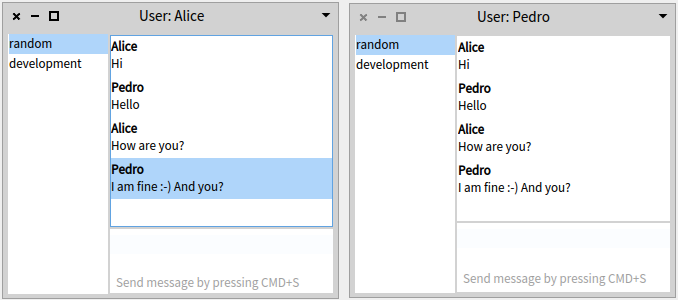

# MQTTChat

[](https://travis-ci.org/JurajKubelka/MQTTChat) [](https://bob-bench.org/r/gh/JurajKubelka/MQTTChat)

[](https://ci.appveyor.com/project/JurajKubelka/mqttchat/branch/master)

A MQTT messaging library for [Pharo](http://pharo.org). It is build on top of [MQTT library](http://github.com/svenvc/mqtt) where you can find more information about [MQTT](http://mqtt.org) in Pharo.


## Installation

Evaluate the following code in Playground:

```
Metacello new
    baseline: #MQTTChat;
    repository: 'github://JurajKubelka/MQTTChat/repository';
    load.
```

### Example

#### Using IoT Eclipse server

To play with it, you can connect to the [IoT Eclipse server](http://iot.eclipse.org). To use a prepared example, execute the following code:

```
MQTTChat exampleAliceAndPedroIoTEclipse.
“And at any moment Bob can connect to the existing chat.”
MQTTChat exampleBobIOTEclipse.
```

#### Using local MQTT server

Similarly, there are examples for a local MQTT server, e.g., [mosquitto](http://mosquitto.org):


```
MQTTChat exampleAliceAndPedroLocal.
“And at any moment Bob can connect to the existing chat.”
MQTTChat exampleBobLocal.
```

### Screenshots 

The UI is very simple. If you close a window, the chat client is automatically disconnected from the server. The client is automatically reconnected on a network failure. You can open `Transcript` in order to see log of network activities.


